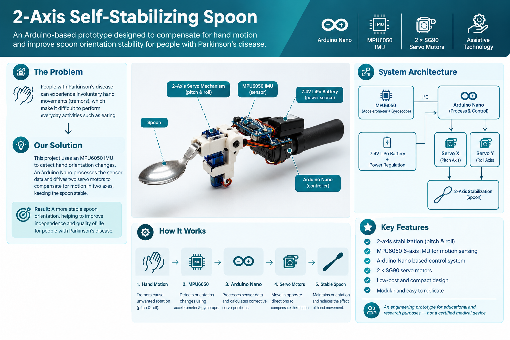
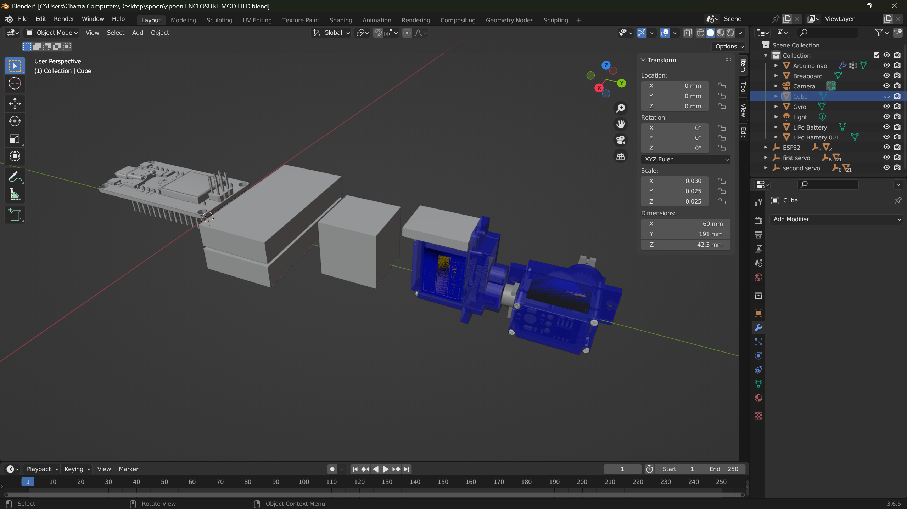
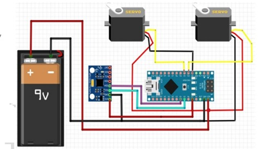

# 2-Axis Self-Stabilizing Spoon

An Arduino-based 2-axis self-stabilizing spoon prototype designed to compensate for hand rotation and improve spoon orientation stability for people affected by Parkinson's disease.

> **Project type:** Embedded Systems / Mechatronics / Assistive Technology  
> **Controller:** Arduino Nano  
> **IMU:** MPU6050  
> **Actuators:** 2 × SG90 servo motors



## Overview

People affected by Parkinson's disease may experience involuntary hand movements and tremors that can make everyday activities such as eating more difficult.

This project explores a low-cost electromechanical approach to reducing the effect of hand rotation on a spoon. An MPU6050 inertial measurement unit (IMU) measures rotational motion, an Arduino Nano processes the measurements, and two servo motors provide compensation about two axes.

The prototype is intended as an **engineering and educational project**, not as a clinically validated medical device.

## Objectives

- Detect rotational hand movement using an IMU.
- Estimate pitch and roll motion.
- Process sensor measurements using an Arduino Nano.
- Generate corrective commands for two servo motors.
- Provide mechanical compensation along two rotational axes.
- Develop a compact, low-cost assistive-technology prototype.

## System Architecture

```text
             Hand Motion
                  │
                  ▼
          ┌─────────────┐
          │   MPU6050   │
          │  6-axis IMU │
          └──────┬──────┘
                 │ I²C
                 ▼
          ┌─────────────┐
          │ Arduino     │
          │ Nano        │
          │             │
          │ Sensor      │
          │ Processing  │
          └──────┬──────┘
                 │
              PWM │
          ┌──────┴──────┐
          ▼             ▼
     ┌─────────┐   ┌─────────┐
     │ Servo X │   │ Servo Y │
     └────┬────┘   └────┬────┘
          │             │
          └──────┬──────┘
                 ▼
          2-Axis Spoon
          Stabilization
```

## Hardware

| Component | Qty. | Purpose |
|---|---:|---|
| Arduino Nano | 1 | Main controller |
| MPU6050 | 1 | Accelerometer + gyroscope |
| SG90 servo motor | 2 | Two-axis actuation |
| 3D-printed spoon structure | 1 | Mechanical support and articulation |
| 7.4 V 2200 mAh 2S LiPo battery | 1 | Main power source |
| Power regulation circuit | 1 | Provides suitable regulated supply |
| Spoon | 1 | End effector |

See [`hardware/BOM.md`](hardware/BOM.md) for the bill of materials.

## Working Principle

1. The MPU6050 senses angular motion of the hand.
2. The Arduino Nano reads the IMU registers through I²C.
3. Gyroscope bias is estimated during startup calibration.
4. The calibrated gyroscope measurements are integrated to estimate pitch and roll changes.
5. The estimated angles are limited to ±30°.
6. The angles are mapped to servo positions between approximately 60° and 120°.
7. The two servos rotate the spoon mechanism in the required compensating direction.

```text
Hand rotates
     │
     ▼
MPU6050 detects angular motion
     │
     ▼
Arduino reads and calibrates gyro data
     │
     ▼
Angular displacement estimated
     │
     ▼
Servo command calculated
     │
     ▼
Two servos compensate the motion
     │
     ▼
Spoon orientation is stabilized
```

## Sensor and Control Method

### MPU6050

The MPU6050 contains:

- 3-axis accelerometer
- 3-axis gyroscope

The sensor communicates with the Arduino Nano using the I²C bus.

The current firmware reads both accelerometer and gyroscope registers. However, the **current angle-estimation implementation is based on calibrated gyroscope integration**; the accelerometer readings are not currently fused into the final angle calculation.

### Gyroscope calibration

At startup, the system collects 2000 gyroscope samples while the device is stationary and calculates the average bias:

```text
Gyro bias = average of stationary gyro measurements
```

The bias is then subtracted from subsequent measurements:

```text
Corrected gyro = measured gyro - gyro bias
```

The device should remain stationary during startup calibration.

### Angle estimation

The current firmware integrates the calibrated gyroscope measurements to estimate angular displacement:

```text
Angle(t) ≈ Angle(t-Δt) + angular_rate × Δt
```

A cross-axis compensation term is also used to account for coupling when the IMU rotates about the yaw axis.

## Servo Control

The firmware uses:

| Function | Arduino Nano pin |
|---|---:|
| X-axis servo | D9 |
| Y-axis servo | D10 |
| MPU6050 SDA | A4 |
| MPU6050 SCL | A5 |

The servo commands are constrained to approximately:

```text
60° ≤ servo position ≤ 120°
```

The X-axis command is reversed in software to match the mechanical orientation of the corresponding servo.

## Mechanical Design

The spoon is mounted on a 2-axis articulated mechanism. The two axes allow the spoon to compensate for rotational movement in two directions, approximately corresponding to pitch and roll.



## Circuit

The system connects the Arduino Nano to the MPU6050 and two servo motors. The battery supplies the system through the power circuit.



> **Power note:** Servo motors can draw significant transient current. The servo supply and regulation circuit should be capable of handling the required current without causing the Arduino or sensor supply to brown out.

## Firmware

The firmware is located in:

```text
firmware/Final_Code.ino
```

The code uses the standard Arduino libraries:

```cpp
#include <Wire.h>
#include <Servo.h>
```

### Main firmware sequence

```text
Initialize serial communication
        ↓
Initialize servos
        ↓
Initialize MPU6050
        ↓
Calibrate gyro bias
        ↓
Read accelerometer + gyro
        ↓
Remove gyro bias
        ↓
Estimate pitch / roll
        ↓
Limit angles
        ↓
Map angles to servo positions
        ↓
Update servos
```

## Installation

### 1. Install Arduino IDE

Install the Arduino IDE and select the appropriate Arduino Nano board and processor option for your board.

### 2. Connect the hardware

Connect:

- MPU6050 → Arduino Nano I²C pins
- X servo → D9
- Y servo → D10
- Servo/power system → appropriate regulated supply

### 3. Open the firmware

Open:

```text
firmware/Final_Code.ino
```

### 4. Upload

Connect the Arduino Nano through USB and upload the sketch.

### 5. Calibration

Keep the spoon and IMU **completely stationary during startup** while the gyroscope calibration routine runs.

## Testing and Results

Experimental results should be added to [`results/testing.md`](results/testing.md).

Recommended measurements include:

| Parameter | Result |
|---|---|
| Maximum compensated angle | TBD |
| Stabilization error | TBD |
| Response time | TBD |
| Operating time | TBD |
| Servo range | 60°–120° |
| Approximate control period | 6 ms |

Do not add estimated values as experimental results. Replace `TBD` only with measured values.

## Limitations

- Gyroscope integration can accumulate drift over time.
- Accelerometer measurements are currently read but are not fused into the angle estimate.
- Servo motors have limited torque, speed, and positioning accuracy.
- Mechanical backlash can reduce stabilization performance.
- Sensor noise affects angle estimation.
- The prototype compensates only for two rotational axes.
- Human hand motion and Parkinsonian tremor are more complex than simple pitch/roll rotation.
- The prototype has not been clinically validated.

## Future Improvements

### Sensor fusion

Implement a complementary filter to combine gyroscope and accelerometer estimates:

```text
Angle = α × GyroAngle + (1 − α) × AccelAngle
```

This can reduce long-term gyroscope drift while preserving the gyroscope's fast response.

### Closed-loop control

A PID controller could be investigated:

```text
Error = Desired angle − Measured angle
```

```text
Control = Kp × Error
        + Ki × ∫Error dt
        + Kd × d(Error)/dt
```

Potential benefits include smoother and more accurate compensation.

### Mechanical improvements

- Reduce mechanical backlash.
- Improve joint stiffness.
- Reduce total weight.
- Improve grip ergonomics.
- Improve the balance of the spoon mechanism.
- Evaluate higher-torque or faster servos if required.

### Electrical improvements

- Use dedicated servo power regulation.
- Add supply decoupling and filtering.
- Add battery voltage monitoring.
- Add appropriate battery protection.

### Experimental evaluation

Future testing could measure:

- Stabilization error.
- Response time.
- Maximum compensable angular movement.
- Battery operating time.
- Performance under different movement frequencies and amplitudes.
- User comfort and usability.

## Safety and Medical Disclaimer

This project is an **engineering prototype for educational and experimental purposes**.

It has not been clinically tested, medically certified, or validated for use as a medical device. It should not be considered a substitute for commercially approved assistive or medical equipment.

Any future development intended for real-world medical use would require appropriate engineering validation, electrical and mechanical safety testing, usability evaluation, clinical evaluation, and applicable regulatory assessment.

## Repository Structure

```text
2-axis-self-stabilizing-spoon/
│
├── README.md
├── LICENSE
├── .gitignore
├── BOM.md
│
├── firmware/
│   └── Final_Code.ino
│
├── hardware/
│   ├── BOM.md
│   ├── circuit/
│   │   └── circuit-diagram.png
│   └── mechanical/
│       └── CAD-files/
│
├── documentation/
│   └── images/
│       ├── project-overview.png
│       └── mechanical-design.png
│
└── results/
    └── testing.md
```

## Contributors
Hiran Dharmapala
Nimesha Nanayakkara
Lasindu Viduranga

**Electrical and Electronic Department, Engineering Faculty, Unversity of Sri Jayewardenepura**

## License

The source code in this repository is released under the **MIT License**.

See [`LICENSE`](LICENSE) for the full license text.

If CAD/hardware source files are added later, consider applying a dedicated open-hardware license such as CERN-OHL to those files rather than treating them as software.

## Acknowledgements

- Arduino ecosystem
- MPU6050 documentation and community resources
- Open-source embedded-systems community

## Disclaimer

This repository is provided "as is" for educational and experimental purposes. No guarantee is made regarding the safety, accuracy, reliability, or suitability of the system for medical or therapeutic applications.
